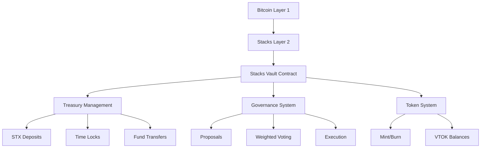

# 🛡️ Stacks Vault - Bitcoin-Secured Treasury Management Protocol

A decentralized autonomous organization (DAO) framework built on Stacks L2, combining Bitcoin's security with programmable DeFi primitives for institutional-grade treasury management.

## 🌟 Overview

Stacks Vault enables community-governed treasury management through Clarity smart contracts, featuring:

- STX deposits with time-locked withdrawals
- 1:1 governance token minting (VTOK)
- Democratic proposal system with weighted voting
- Trustless execution of approved transactions
- Bitcoin-finalized security via Stacks L2



## 🔑 Key Features

| Component               | Description                                                                 |
|-------------------------|-----------------------------------------------------------------------------|
| ⚡️ **Bitcoin-Secured**  | Inherits security through Stacks' proof-of-transfer (PoX) consensus         |
| 🔒 **Time-Locked Vault**| Configurable withdrawal lock period (default 10 days)                       |
| 🗳️ **Weighted Voting** | Governance power proportional to VTOK holdings                              |
| 💸 **Proposal Engine**  | Create funding requests with custom amounts/targets/execution deadlines     |
| 🔄 **Trustless Execution**| Automated STX transfers for approved proposals                            |

## 📜 Smart Contract Essentials

### Core Functions

```clarity
;; Deposit STX to mint governance tokens
(define-public (deposit (amount uint)))

;; Submit funding proposal
(define-public (create-proposal (recipient principal) (amount uint) (description (string-utf8 256))))

;; Cast weighted vote
(define-public (vote (proposal-id uint) (approve bool)))

;; Execute approved proposal
(define-public (execute-proposal (proposal-id uint)))
```

### Data Structures

```clarity
;; Proposal storage
(define-data-var proposals {proposal-id: uint} {
    creator: principal,
    amount: uint,
    recipient: principal,
    end-block: uint,
    yes-votes: uint,
    no-votes: uint,
    executed: bool
})

;; User balances
(define-map balances principal uint)
```

## 🛠️ Developer Setup

### Requirements

- Clarinet 2.0.0+
- Node.js 18+
- Stacks.js

```bash
git clone https://github.com/joy-fmt/stacks-vault.git
cd stacks-vault
npm install

```

## 📋 Usage Examples

### Deposit STX & Mint VTOK

```typescript
// Lock 500 STX for governance power
await vault.deposit(500000000);
```

### Create Funding Proposal

```clarity
(contract-call? .stacks-vault create-proposal 
    'SP3FBR2AGK5H9QBDH3EEN6DF8EK8JY7RX8QJ5SVTE 
    150000000 
    (utf8 "Q3 Marketing Campaign") 
    20160)
```

### Execute Approved Proposal

```bash
clarinet console --testnet
>> (contract-call? .stacks-vault execute-proposal 42)
```

## 🗳️ Governance Lifecycle

1. **Deposit** → Lock STX to receive VTOK (1:1 ratio)
2. **Propose** → Create funding request (min 500 STX)
3. **Vote** → Cast weighted votes during 1-14 day period
4. **Execute** → Automatic transfer if quorum reached
5. **Withdraw** → Redeem STX after lock period expires

## 🔒 Security Architecture

### Protocol Safeguards

- Reentrancy protection via Clarity's static analysis
- Time-lock enforced at contract level
- Minimum proposal duration (144 blocks)
- Double-voting prevention through vote tracking
- Separate proposal execution phase

### Audit Recommendations

1. Third-party smart contract audit
2. Multi-sig upgrade mechanism
3. Circuit-breaker emergency pause
4. Gradual testnet deployment

## 🤝 Contributing

1. Fork repository
2. Create feature branch (`git checkout -b feature/improvement`)
3. Commit changes (`git commit -am 'Add new feature'`)
4. Push to branch (`git push origin feature/improvement`)
5. Open Pull Request
